# Truelache

## Índice

* [1. El proyecto](#1-el-proyecto)
* [2. Historias de usuarios](#2-historias-de-usuario)

## 1. El proyecto

Truelache es una red social sin fines de lucro, que nace del gran concepto de trueque, el que consiste en la acción de dar una cosa y recibir otra a cambio. 
Es por eso que, este proyecto facilita la adquisición de nuevos productos por medio de la permutación, trueques y/o cambalaches con otros usuarios.

### 1.1 Definición del producto
- Los principales usuarios que tienen acceso a esta red social son todos aquellos que buscan intercambiar sus bienes. En Truelache se resolverán las problemáticas de querer cambiar sus cosas, ya sea por renovación, necesidad, deseo, entre otros.

- Dada una encuesta realizada a los usuarios, se pudo obtener respuestas que manifestaban sus principales necesidades que requerirían al usar Truelache, estas demandas fueron satisfechas por medio de la ejecución de las [historias de usuario](#2-historias-de-usuario).

- La definición final del producto se logró a través de la iteración de feedbacks entre compañeros y/o coaches, logrando de esta forma una mejor usabilidad y experiencia de usuario.

### 1.2 Prototipo baja fidelidad

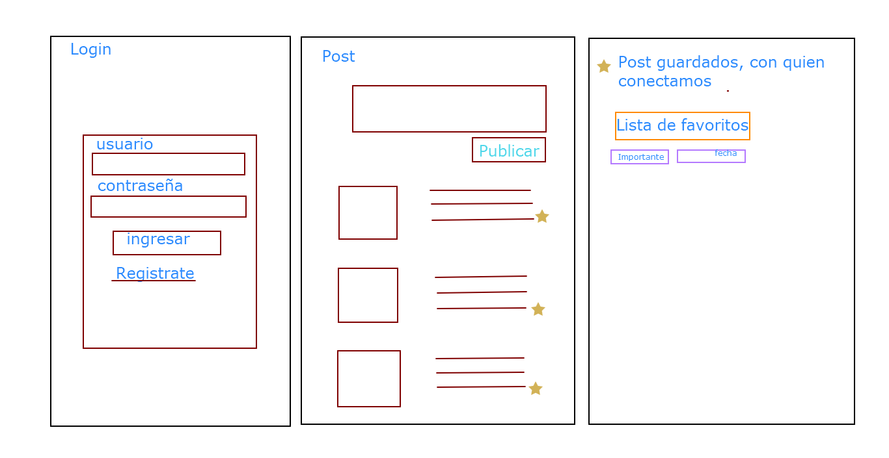

### 1.3 Paleta de colores

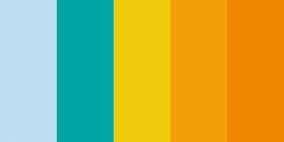 

### 1.4 Prototipo Alta Fidelidad

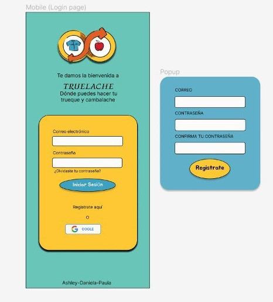
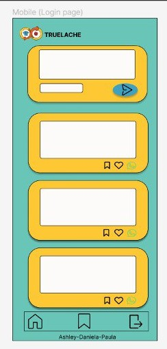
### 1.5 Producto Final
Vista Responsive Movil

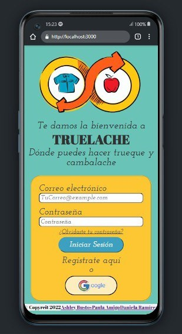
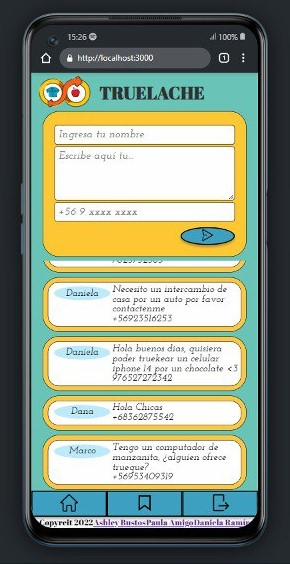

Vista Responsive Escritorio
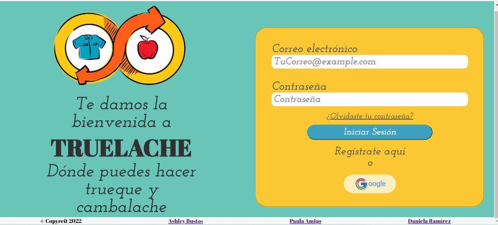 
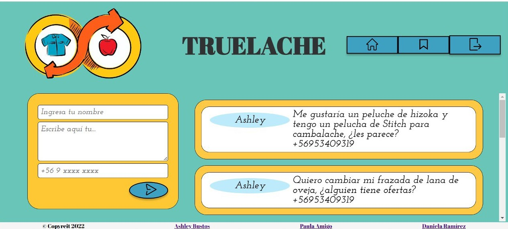 

## 2. Historias de usuario

Para lograr tener una idea de qué funcionalidades debe tener nuestra Red Social, realizamos un form, el cual nos ayudó a recopilar la información de preferencia de distintos usuarios.

### 2.1 Conectar para hacer Trueques

Según nuestra encuesta, los usuarios buscan llegar a una app que logre realizar trueques y/o cambalache, lo cual los beneficia a ellos y beneficia al medio ambiente.
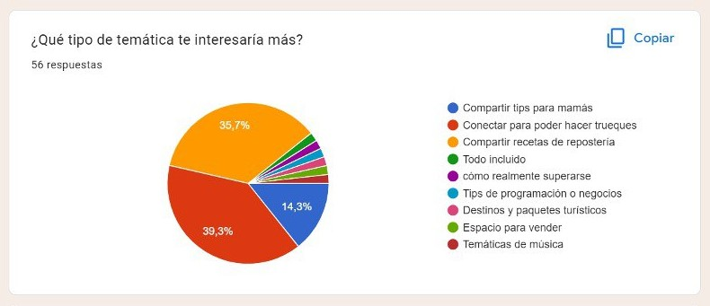 

### 2.2 Loguearse con Google

Se puede ver en la encuesta que los usuarios tienen una gran preferencia por loguearse con Google. Esto es, ya que la mayoría de las personas tienen cuenta Google y les es más fácil para ellos tener todo con un mismo correo y contraseña.
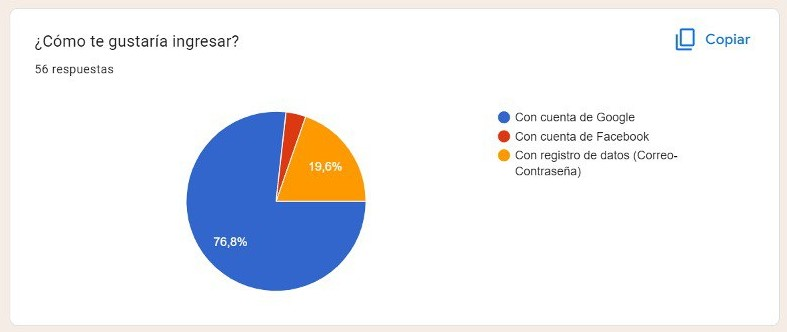

### 2.3 Postear en el muro

Como se muestra en la encuesta y también por lo cual creamos esta red social, es para poder mostrar la información en el muro de lo que queremos cambiar. Es importarte para lo usuarios poder entregar esta información, por lo cual, también agregamos el número de teléfono para que sea más fácil y directa la comunicación entre usuarios.
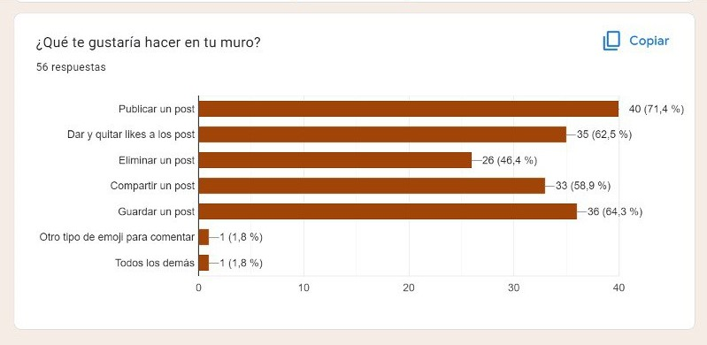  
